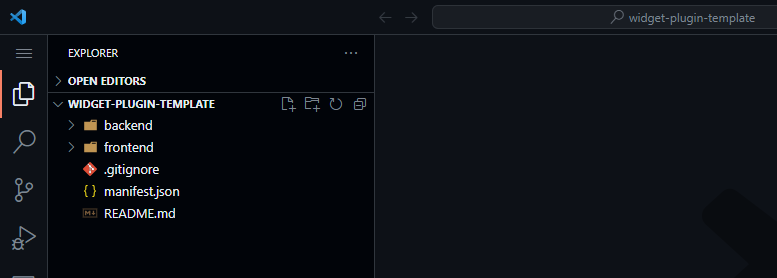
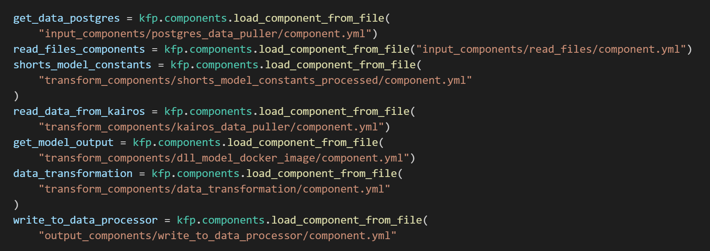

# ut_plugin_manager


## Introduction
A suite of services to manage plugins in UnifyTwin

## Minimum Requirements
1. Python 3.9+
2. FastAPI
4. PyJWT


## Environment Variables
| Sno | Env Name                  | Default                               |
| --- | ------------------------- | ------------------------------------- |
| 1   | service\_host             | "127.0.0.1"                           |
| 2   | service\_port             | 8671                                  |
| 3   | SECURE\_ACCESS            | TRUE                                  |
| 4   | ENABLE\_CORS              | TRUE                                  |
| 5   | CORS\_URLS                | \["\*.ilens.io", "\*.unifytwin.com"\] |
| 6   | CORS\_ALLOW\_CREDENTIALS  | TRUE                                  |
| 7   | CORS\_ALLOW\_METHODS      | \["GET", "POST", "DELETE", "PUT"\]    |
| 8   | CORS\_ALLOW\_HEADERS      | \["\*"\]                              |
| 9   | DIGITAL\_SIGNATURE\_PROXY | None                                  |
| 10  | LOG\_LEVEL                | INFO                                  |
| 11  | SW\_DOCS\_URL             | None                                  |
| 12  | SW\_OPENAPI\_URL          | None                                  |
| 13  | SECURE\_COOKIE            | TRUE                                  |
| 14  | MONGO\_URI                |                                       |
| 15  | REDIS\_URI                |                                       |
| 16  | REDIS\_LOGIN\_DB          |                                       |
| 17  | REDIS\_USER\_ROLE\_DB     |                                       |
| 18  | REDIS\_PROJECT\_DB        |                                       |
| 19  | SIGNATURE\_KEY\_SIZE      | 1024                                  |
| 20  | BASE\_PATH                | /code/data                            |
| 21  | DCP_URL                   |                                       |
| 22  | DOCKER_HOST               |                                       |


## Procedure to Run in Production
1. Pull the repo
2. Install requirements and ensure all environment variables are set
    ```
   pip install -r requirements.txt
   ```
3. Run the code
    ```
   uvicorn main:app --proxy-headers
   ```
4. Go to `http(s)://<your-bind-ip>:<port>/docs` to explore more

# Usage Document


Project Customization Documentation for Developers

FactoryTalk DataMosaix Private Cloud (FT-DM-PC)

**Last Updated**: 21-Feb-2024


# Contents

[Overview](#overview)

[Deployment Process](#deployment-process)

[Developer Plugins](#developer-plugins)

[Deploy Custom Code / Components / Pipelines](#deploy-custom-code-components-pipelines)

[Creation of Kubeflow Components](#creation-of-kubeflow-components)

[Structure for the Components](#structure-for-the-components)

[Building Components](#building-components)

[Before you begin](#before-you-begin)

[Understanding pipeline components](#understanding-pipeline-components)

[Designing a pipeline component](#designing-a-pipeline-component)

[Steps to create the component:](#steps-to-create-the-component)

[Component creation from Docker Image](#component-creation-from-docker-image)

[Creation of Pipelines](#creation-of-pipelines)

[Pipeline Page](#pipeline-page)

[Components Explanation in Pipeline](#components-explanation-in-pipeline)

[Plugin Authentication](#plugin-authentication)


# Overview

FT-DM-PC is a No/Low code platform, and it comes with a wide variety of
features available on it. Multiple development teams can work
simultaneously and contribute code for any feature developments along
with core team. Platform supports integrating external team's code into
the platform seamlessly, with the help of Microservices, Micro Frontend,
Developer Plugins (Widgets, Logbook Components), API Masking, Style
Customizations\... so on. Customer project team can get on-boarded and
deliver the customized features without depending on the core
development team.

Let\'s understand in detail on the scope teams\...

a.  **Core Team (FT-DM-PC)**\
    Any feature that makes sense to all the customers and adds value to
    the product will be considered as a product delivery item and the
    core team will take this up as part of the product release cycle.
    This decision will be made by the FT-DM-PC product owners and
    leaders.

b.  **Customer Project Team**

> If customer expectations are to have customized features/
> functionalities, it must be done according to that.
>
> This document gives a detailed understanding of how a customer project
> can be executed on top of FT-DM-PC platform.

1.  This is purely a question of how CSMs/Solution Architects manage
    expectations with clients.

    -   Any low code product will have a set of configurations and
        FT-DM-PC has benchmarked with many - so this is expectation
        setting with client.

    -   Please make the configuration changes based on what is available
        in the product (FT-DM-PC) and always release as the first
        version.

2.  On customizations

-   Over and above, what is configurable, Lead/CSM/SA must document all
    customizations the client wants and produce a flow walkthrough (like
    what was done in Pepsi/PGP)

-   Any customizations can now be done by the project team through
    plugins. This capability has enabled PRIMARILY to unblock project
    teams and allows people to develop code instead of just doing
    configurations.

-   Estimate for the list of customizations and staff UI/BE/QA/Data
    Science people from your project, and this must be billable. This
    needs proactive planning, and one cannot raise a bunch of
    requirement tickets at the last minute with a timeline dependency.
    Lead/CSM/SA should find the right balance on what is free
    customization work (vs) what is billable -- this is always
    subjective for each client, and this is where skillful negotiation
    comes in.

# Deployment Process

Below is the process defined for executing a customer project on
FT-DM-PC (UT) product where customized feature development is required
or done.

1.  Any deployment in the client environment (Dev/Prod) should be done
    using the latest released version of the product. All patches and
    upgrades will be done on top of that version. No code from the
    product Dev/QA branch should be deployed in a client environment.

2.  The code for customizations done through plugins should be managed
    by the project team.

3.  Since the whole product UI code resides in a single repository, if
    any core feature enhancement or customization is planned (least
    case) then the code for that can be cloned from the latest released
    version and customizations can be done on top of that. The same
    changes must be communicated to the FT-DM-PC product leads so that
    they can merge these changes for the ongoing release after proper
    review. The new code must be tested and reviewed by the project team
    leads before raising a PR/MR.

4.  For core product feature changes which are due in the ongoing
    release and are required to be available in the client environment
    immediately for any demo purpose, must only be patched on the
    existing client environment version. The development for the core
    product patch can be either done by the project or the product team
    based on bandwidth and should be first merged into the product Dev
    and QA branch after proper review by the FT-DM-PC product lead(s).
    Once the patch is validated it can be deployed in the client
    environment.

5.  The client environment should be regularly upgraded after every
    FT-DM-PC release if there is active development going on for the
    project.

## Developer Plugins

Developer plugins are indispensable tools helping in streamlining
workflows. FactoryTalk DataMosaix supports developer plugins tailored to
the diverse needs of developers based on different customer verticals.

**Why should we use Plugins?**

-   **Seamlessly Integrated Development**: FT DataMosaix\'s developer
    plugins seamlessly integrate with popular IDEs, ensuring a unified
    user experience across different development environments. This
    integration simplifies the user journey, enabling developers to
    harness FT DataMosaix\'s plugins without disruptions. This
    simplicity allows developers to focus on their core task: producing
    high-quality code.

-   **Versatile Functionality**: FT DataMosaix\'s developer plugins
    boast an array of functionalities designed to cater to various
    development requirements. From code analysis and debugging to
    version control, these plugins offer a comprehensive toolkit. This
    approach saves developers time by consolidating essential tools
    within a single ecosystem.

-   **Fostering Collaboration**: Modern software development thrives on
    collaboration, and FT DataMosaix\'s developer plugins facilitate
    this aspect. Real-time code sharing, collaborative debugging, and
    efficient communication are supported, enabling teams to work
    cohesively. By breaking down barriers, these plugins encourage
    teamwork and synergistic outcomes.

-   **Ongoing Support and Updates**: Staying current with the latest
    tools and technologies is vital in the dynamic realm of software
    development. FT DataMosaix demonstrates its commitment by offering
    consistent updates and responsive support for its developer plugins.
    This commitment ensures developers have access to the latest
    advancements and timely solutions.

**Practices to be followed:**

-   Each Git repository should only be associated with one plugin,
    ensuring clear management of Dev, QA, and Master branches for each
    repository. This approach helps effective version control of the
    plugin and is crucial for maintaining standard practices across all
    FTDM modules.

-   The microservice plugin or backend module of a widget plugin has the
    capability to integrate numerous API endpoints within a single
    plugin, based on resource availability and processing capacity.
    Hence, developers have the flexibility to implement related
    functionalities within the same plugin as distinct endpoints.

-   Utilize the environmental variable feature for configuring values
    that could potentially change in the future. This allows
    administrators to update configuration values without changing the
    codebase and redeploying.

-   Optimize the repository to reduce the size of the Docker image by        writing   an optimized multi-stage Dockerfile. Use slim base images to minimize the     final image size.

Platform supports multiple types of plugins list below.

1.  **Widget Plugin**

The Widget plugin facilitates the creation of new widgets within the
FTDM application, enhancing data visualization for improved analytics.
With this plugin, developers can consolidate both frontend and backend
code into a single bundle, simplifying deployment within the
application.

Getting Started with IDE setup:

Each repository created contains Frontend and Backend Implementation for
a widget. Launch an IDE of your choice and head to the terminal of the
parent directory of the working directory.\
\
Clone the template repo:\
\
***git clone***
[***https://gitlab-pm.knowledgelens.com/KnowledgeLens/Products/iLens-2.0/core/developer-utils/widget-plugin-template.git***\
\
](https://gitlab-pm.knowledgelens.com/KnowledgeLens/Products/iLens-2.0/core/developer-utils/widget-plugin-template.git)The
following is the folder structure for a widget plugin:\

\
\
You\'ll just have to work on your services and write methods for
respective handlers. You\'ll now be switching to this directory for
developing your brand-new plugin!\
\
***cd backend***\
Install all dependent requirements.\
\
***pip install -r requirements.txt***\
\
"Do not delete any Default services already added."

**Knowing your project structure**


| **Folder Name**               |      **Significance**
|-------------------------------|-------------------------------------
|  backend                      |      This is where your backend code
|                               |      dwells. This has all the necessary
|                               |     files it takes to run your python
|                               |     app
| frontend                      |    This is where your front-end code
|                               |    dwells. This has all the code
|                               |    related to widget configuration
|                               |    screens or preview
| backend/scripts/core/services |    This is where your services will be
|                               |    present. Developers can start with
|                               |    Preview service, which loads the
|                               |    chart on a dashboard. A TODO is
|                               |    added for reference.
| backend/scripts/core/handlers |    This is where the method
|                               |    implementation for the respective
|                               |    services will be present
| backend/scripts/templates     |    This is where the build files will
|                               |    be generated once the plugin is
|                               |    deployed. All build files along
|                               |    with any other files get copied
|                               |    here
| backend/app.py                |    Runs the python app
| manifest.json                 |    The developer can update any
|                               |    environment variables they depend
|                               |    on, and metadata related to the
|                               |    plugin they\'d like to maintain in
|                               |    the VCS.


**Frontend:**

> Ensure you have the following installed on your machine:\
> 1. Node.js (\>= v14.16.1 & \<= v16.0.0)\
> 2. Angular CLI (\>= v12.0.0 & \<= v16.0.0)
>
> Ideal system requirements

1.  RAM: 16GB (Min. 8GB)

> **Step 1:** Open terminal / command prompt and use the below commands
> to setup widget plugin project
>
> ***ng new \<plugin-name\>***
>
> Generate an Angular component in the newly created project to start
>
> ***ng generate component \<component-name\>***
>
> **E.g.:** ng generate component my-element
>
> **Step 2:** Install Angular Elements package to your project to make
> it a Web Component
>
> ***npm install \@angular/elements***
>
> Update the app.module.ts file to register the Angular Element
>
> ***constructor(private injector: Injector) {***
>
> ***const myElement = createCustomElement(MyElementComponent, {
> injector });*** ***customElements.define(\'my-element\',
> myElement);***
>
> ***}***
>
> In the above code specify the name of the selector with which you want
> to expose the element.
>
> **Step 3:** Add "ngDoBootstrap" life cycle hook and define bootstrap
> as empty array ('\[\]') in your app.module.ts file\
> \
> 
>
> **Step 4:** Create widgetConfig.json file inside assets folder with
> the the below format and provide necessary inputs.
>
> ***{***
>
> ***\"selector\": \"my-element\",***
>
> ***\"settings\": {***
>
> ***\"config_tabs\": {***
>
> ***\"general\": true,***
>
> ***\"chartProp\": true***
>
> ***}***
>
> ***}***
>
> ***}***
>
> "***selector***": This will be the entry point component for widget to
> load
>
> "***settings.config_tabs***": Tabs to show while configuring the
> widget (All options - general, chartProp, data, tools)
>
> Once the code is pushed to the respective git repository then it is
> ready to deploy in FT-DM-PC platform (via Developer Plugins)
>
> You can refer to the below sample widget plugin template
>
> <https://gitlab-pm.knowledgelens.com/KnowledgeLens/Products/iLens-2.0/core/developer-utils/widget-plugin-template/-/tree/widget_template>
>
> **How to register Widget Plugin via Developer Plugins?**
>
> Navigate to the FT-DM-PC platform to Developer Plugins screen you can
> register your newly developed plugin. Click on "Create New" button and
> input the details and save it.
>
> 
>
> 
>
> Once saved you need to click on "Deploy" icon for the plugin from the
> table view. It should Ideally take few minutes to deploy the plugin
> and the status should be "Running"
>
> **Adding a Widget Instance using a plugin:**
>
> Go to Insights \> Dashboards\
> \
> Head to any dashboard and click on the \"Create widget\" icon. You can
> find already deployed plugins in the respective categories with a
> badge "Plugin"\
> \
> 
> \
> Select the widget and configure it. The screens developed as part of
> the plugin front-end code should load on the dashboard seamlessly.

1.  **Microservice as Plugin**

> Microservice will follow the same procedure as widget plugins. Except
> for the fact that there needs to be a ***Dockerfile*** present in the
> repo to deploy the Microservice.
>
> Once the plugin is available in git you can register in "Developer
> Plugins" like below\...
>
> 
>
> Microservice plugin gives the flexibility to basically develop and
> deploy any type of containerized application without much technical
> constraints. The only requirement for the microservice plugin is that
> the application can be containerized and should have the respective
> Dockerfile for the same.
>
> Once a Microservice plugin is deployed and goes to running state, it
> will be accessible over a dynamically generated URI, which can be
> obtained from the info button of the respective Microservice Plugin,
> as shown below.
>
> 

# Deploy Custom Code / Components / Pipelines

## Creation of Kubeflow Components

### **Structure for the Components**

1.  Each component needs to be in its own folder.

2.  Create a new folder called "src" within its own folder, and in that
    folder, a new file called "program.py" that should include our
    function (which is going to be converted as component)

3.  Include the predefined "build_component.py" file, which is used to
    generate the component.yml and README.md files.

4.  Add a requirement.txt file containing all the packages required for
    just that component.

5.  Create a file called variables.yml that contains all the environment
    variables needed for that component.

6.  Input, transform, and output should be used to categorize
    components.

    1.  If a component is the pipeline's first component, it should be
        > regarded as an input component.

    2.  The component is a transform component if it is in between other
        > components, i.e., if its input comes from another component's
        > output and its output goes to another component's output.

    3.  If the component is the final component in the pipeline and
        > receives all its input from earlier components then that is
        > output component

**Note:** If we do not provide versions for each package in the
requirement.txt file while using the build_component.py script to create
the component.yml file, the component will not successfully be created.

### **Building Components**

#### "A tutorial on how to create components and use them in a pipeline."

A pipeline component is a self-contained set of code that performs one
step in your ML workflow. This document describes the concepts required
to build components and demonstrates how to get started building
components.

### **Before you begin**

Run the following command to install the Kubeflow Pipelines SDK.

**'python \$ pip3 install kfp --upgrade'**

\* We used the **kfp version==1.8.22**

For more information about the Kubeflow Pipelines SDK, see the [SDK
reference
guide](https://kubeflow-pipelines.readthedocs.io/en/latest/index.html).

### **Understanding pipeline components**

Pipeline components are self-contained sets of code that perform one
step in your ML workflow, such as preprocessing data or training a
model. To create a component, you must *build the component's
implementation* and *define the component specification*.

Once you have built your component's implementation, you can define your
component's interface as a component specification. A component
specification defines:

7.  The component's inputs and outputs.

8.  The component's metadata, such as the name and description.

### **Designing a pipeline component**

When you design your component's code, consider the following:

9.  Which inputs can be passed to your component by value? Examples of
    inputs that you can pass by value include numbers, Booleans, and
    short strings. Any value that you could reasonably pass as a
    command-line argument can be passed to your component by value. All
    other inputs are passed to your component by a reference to the
    input's path.

10. To return an output from your component, the output's data must be
    stored as a file. When you define your component, you let Kubeflow
    Pipelines know what outputs your component produces. When your
    pipeline runs, Kubeflow Pipelines passes the paths that you use to
    store your component's outputs as inputs to your component.

11. Outputs are typically written to a single file. In some cases, you
    may need to return a directory of files as an output. In this case,
    create a directory at the output path and write the output files to
    that location. In both cases, it may be necessary to create parent
    directories if they do not exist.

12. Your component's goal may be to create a dataset in an external
    service, such as a Big Query table. In this case, it may make sense
    for the component to output an identifier for the produced data,
    such as a table name, instead of the data itself. We recommend that
    you limit this pattern to cases where the data must be put into an
    external system instead of keeping it inside the Kubeflow Pipelines
    system.

## Steps to create the component:

#### Component creation from python function

1.  To generate **Component Structure,** we have a script called
    **base_structure_creation.py** which will create the structure of
    component.


1.  **Define the Function:** When writing a function, if your component
    or function necessitates one or more additional functions, you can
    define those functions within the main function (Nested function).


1.  **Define the Packages:** It is imperative to specify the packages
    along with their respective versions once the functions are
    prepared. Failure to provide the version may impede the component
    creation process.


1.  **Define the Variables:** Below is the format to mention the
    environment variables.


1.  **Component Creation:** To access the variable, you need to declare
    it. Use **os.getenv()** in the program.py file for variable access.
    After this setup, you can execute the **build_component.py**
    (Generic Script). This script will generate the **component.yml**
    file automatically. You don't need to worry about the process; it
    will handle the generation along with the **README.md** file. This
    marks the completion of the component creation process.


> **Points to be noted:**
>
> **a.** In Kubeflow, input and output paths are specified because
> directly passing large JSONs, lists, or data frames between components
> can pose challenges, especially when they are extensive.
>
> **b.** In terms of data flow, an \"input path\" indicates that your
> component expects input parameters from another component or source.
> Conversely, an \"output path\" signifies that your component will
> produce some output. It\'s important to declare where this output will
> be stored.
>
> **c.** Output variables can take any form, but the data type is
> crucial and is typically imported from **KFP.component**. For example,
> if your component converts a data frame and writes it to a CSV, you
> specify the output path for this data.
>
> **d.** When your component returns something, whether it\'s a string
> or a small list, you can use the standard return statement.
> Additionally, explicitly mention the return type, such as a list, etc.
>
> **e.** This structure remains consistent across all components. They
> all have both input and output paths, adhering to this format.

#### **component.yml**


#### **Component Segregation**

13. **Input Component:** This will act as an input component to the
    pipeline. It acts as the main input to your pipelines.

14. **Output Component:** Refers to the last component in the pipeline
    and the components that will provide the output after all component
    executions.

15. **Transform Component**: Refers component between Input and output.

> **├── input_components**\
> **│ ├── \*component name\***\
> **│ │ ├── src**\
> **│ │ │ ├── program.py**\
> **│ │ ├── build_component.py**\
> **│ │ ├── component.yml**\
> **│ │ ├── README.md**\
> **│ │ ├── requirements.txt**\
> **│ │ ├── variables.yml**\
> **│**\
> **├── output_components**\
> **│ ├── \*component name\***\
> **│ │ ├── src**\
> **│ │ │ ├── program.py**\
> **│ │ ├── build_component.py**\
> **│ │ ├── component.yml**\
> **│ │ ├── README.md**\
> **│ │ ├── requirements.txt**\
> **│ │ ├── variables.yml**\
> **│**\
> **├── transform_components**\
> **│ ├── \*component name\***\
> **│ │ ├── src**\
> **│ │ │ ├── program.py**\
> **│ │ ├── build_component.py**\
> **│ │ ├── component.yml**\
> **│ │ ├── README.md**\
> **│ │ ├── requirements.txt**\
> **│ │ ├── variables.yml**\
> **│**

## Component creation from Docker Image

16. Due to the unique nature of a specific component containing a DLL
    file received from the client, it couldn\'t be directly converted
    into a typical Kubeflow component. The DLL file was encoded within a
    Python script using pytransform, and an additional pythonform.dll
    file was provided.

17. To address this, we opted to convert only this part of the process
    into a Docker image. All other regular components were integrated
    into this Docker image.

18. The Docker image processes the data and generates outputs, which are
    then utilized as Output 1 and Output 2 in the overall pipeline. This
    approach enables seamless incorporation of the specialized DLL-based
    component into the broader Kubeflow.


## Creation of Pipelines

Once you have all the components, the next step is to start connecting
them according to the designed Kubeflow pipeline. The process begins
with loading the components. To load the components, you utilize KFP
(Kubeflow Pipelines), an SDK for Kubeflow. This SDK is publicly
available and provides the necessary tools for seamless Kubeflow
construction.



**1. Set Display Name:**

In Kubeflow Pipelines, you can utilize the **set_display_name()**
function to assign a custom display name to a component. This display
name is used to represent the component on the user interface (UI). If a
display name is not explicitly set, the default name provided during the
function declaration inside the component will be used. This offers
flexibility in customizing the display name as needed to enhance clarity
in the UI.


When dealing with components that have multiple outputs in Kubeflow
Pipelines, utilize dot notation and reference the variable used during
function or component definition to access the desired output. For a
single output, you can use dot notation directly. This approach provides
flexibility when working with components that produce varying numbers of
outputs.


**2. Adding Secrets:**

1.  Setting up secrets for each component is crucial to ensure they have
    the necessary access credentials, maintaining security and access
    control throughout the pipeline.


**3. Pipeline Yaml Creation:**

1.  Create the final YAML file for your Kubeflow pipeline.

2.  The 'pipeline.yaml' is the desired name for the YAML file.


**4. Resource Allocation:**

Before deploying components in Kubeflow Pipelines, it\'s crucial to
carefully allocate resources to prevent excessive resource usage, which
can lead to inefficiencies and potential bottlenecks. To ensure optimal
resource management, follow these steps:

1.  **Specify Resource Limits and Requests**: In the YAML file
    describing your pipeline components, explicitly define resource
    limits and requests for each component. This ensures that Kubernetes
    allocates appropriate resources to each component during execution.

2.  **Follow Deployment Procedures**: Once resource allocation is
    configured in the YAML file, follow the informed deployment
    procedure to deploy the pipeline in Kubeflow. This involves
    submitting the pipeline definition to the Kubeflow Pipelines
    platform for execution.

By incorporating these practices into your pipeline development process,
you can effectively manage resource utilization and maintain performance
consistency throughout the pipeline execution.


### **Pipeline Page**


## Components Explanation in Pipeline

#### **1. Read Data from Blob**

##### **Overview**

24. **Component Name:** Read dataframe

25. **Component Description:** This component is utilized to read the
    configuration JSON from Azure Blob Storage, where the JSON contains
    details such as configured banks, all related queries, and all
    related tags.

26. **Component Type:** Input type

##### **Component Parameters**


| **Variable Name**         | **Data Type** | **Required/Optional** | **Description**                                                |
|---------------------------|---------------|-----------------------|----------------------------------------------------------------|
| AZURE_CONNECTION_STRING    | String        | Required              | Azure environment connection string                            |
| CONTAINER_NAME             | String        | Required              | Name of the container in Azure                                 |
| BLOB_NAME                  | String        | Required              | Name of the blob in the container                              |
| FILE_FORMAT                | String        | Required              | Supported file formats: csv, excel, text, parquet, json         |
| STORAGE_LOCATION           | String        | Required              | Storage location, e.g., Azure                                  |
| out                        | String        | Required              | This is the output path where data is stored                   |

**Note 1:** Available Component types are: Input, Transform, Output.

**Note 2**: Available Environment types are: env, InputValues,
InputPath, OutputValues, OutputPath, PipelineParm

#### **2. Postgres data puller**

##### **Overview**

27. **Component Name:** Postgres data puller

28. **Component Description**: This component is used to get the
    dataframe in the csv file from the given DB name and the given
    query.

29. **Component Type**: Input type

##### **Component Parameters**
| **Variable Name**             | **Datatype** | **Required/Optional** | **Type**     | **Description**   | **Example**                                                                                                   |
|-------------------------------|--------------|-----------------------|------------- |-------------------|---------------------------------------------------------------------------------------------------------------|
| POSTGRES_SQL_CONSTANT_QUERY    | String       | Required              | env         |                   |                                                                                                               |
| POSTGRES_SQL_SCHEMA            | String       | Required              | env         |                   |                                                                                                               |
| POSTGRES_URI                   | String       | Required              | env         |                   |                                                                                                               |
| POSTGRES_SQL_INPUT_DATABASE     | String       | Required              | env         |                   |                                                                                                               |
| out                            | String       | Required              | outputPath  | Output data written in this path | variables,value\ Current Percentage Change (Kilo Ampere),0.5\ Threshold (KA),450.0\ Min Voltage,250.0\ Max Voltage,650.0\ Voltage Change (millivolt),20.0 |


**Note 1:** Available Component types are: Input, Transform, Output.

**Note 2 :** Available Environment types are: env, InputValues,
InputPath, OutputValues, OutputPath, PipelineParm

#### **3.Get configured banks**

##### **Overview**

30. **Component Name:** Get configured banks.

31. **Component Description:** This component is used to get the banks
    list.

32. **Component Type:** Transform type.

##### **Component Parameters**

| **Variable Name** | **Datatype** | **Required/Optional** | **Type**  | **Description**      | **Example**                                                                 |
|-------------------|--------------|-----------------------|-----------|----------------------|-----------------------------------------------------------------------------|
| conf              | String       | Required              | inputPath | Config JSON where all details are stored | { "data": { "tag_metadata": { "configured_banks": [] } } }                   |
| Output            | JSON Array   | Required              | outputPath|                      |                                                                             |


**Note 1:** Available Component types are: Input, Transform, Output.

**Note 2**: Available Environment types are: env, InputValues,
InputPath, OutputValues, OutputPath, PipelineParm

#### **4.Kairos Data puller**

##### **Overview**

33. **Component Name**: Get data.

34. **Component Description**: This component is used to get the data
    from the Kairos DB.

35. **Component Type**: Transform type.

##### **Component Parameters**

| **Variable Name** | **Datatype** | **Required/Optional** | **Type**   | **Description**       | **Example**                         |
|-------------------|--------------|-----------------------|------------|-----------------------|-------------------------------------|
| conf_json         | String       | Required              | inputPath  | Config JSON where all details are stored | { "data": { "tag_metadata": { "configured_banks": [ "Bank_1", ... ] } } } |
| bank_no           | String       | Required              | inputValue | Bank that needs to be configured  | Bank_1, Bank_2, etc.               |
| avg_vlt           | Boolean      | Required              | inputValue | Whether average voltage data or normal data is needed | True or False                      |
| DB_HOST_URL       | String       | Required              | env        | Database host URL                 |                                     |
| KAI_ROS_USERNAME  | String       | Required              | env        | KAI ROS username                  |                                     |
| KAI_ROS_PASSWORD  | String       | Required              | env        | KAI ROS password                  |                                     |
| out               | String       | Required              | outputPath | Path where the output is written  |                                     |


**Note 1:** Available Component types are: Input, Transform, Output.

**Note 2:** Available Environment types are: env, InputValues,
InputPath, OutputValues, OutputPath, PipelineParm

#### **5. Model constants processed**

##### **Overview**

36. **Component Name**: Model constants processed.

37. **Component Description:** Used to preprocess the data

38. **Component Type:** Transform type

##### **Component Parameters**

| **Variable Name** | **Datatype** | **Required/Optional** | **Type**   | **Description**           |
|-------------------|--------------|-----------------------|------------|---------------------------|
| input             | String       | Required              | inputPath  | Input data to the component |
| out               | String       | Required              | outputPath |                             |


**Note 1:** Available Component types are: Input, Transform, Output.

**Note 2:** Available Environment types are: env, InputValues,
InputPath, OutputValues, OutputPath, PipelineParm

**6. Get DLL Model Output:** "This component is used to get the output
from the model provided."

**6. Get Average Voltage Data:** "This component is used to get the
average voltage data from Kairos DB."

#### **6. Data Transformation**

##### **Overview**

39. **Component Name**: Data transformation

40. **Component Description**: This component is used for performing
    transformation in the data.

41. **Component Type**: Transform type

##### **Component Parameters**

| **Variable Name** | **Datatype** | **Required/Optional** | **Type**   | **Description**    | **Example**                             |
|-------------------|--------------|-----------------------|------------|--------------------|-----------------------------------------|
| selected_bank     | String       | Required              | inputValue | Which bank is selected | Bank_1                                 |
| conf_json         | String       | Required              | inputPath  | Configure JSON       | { "data": { "tag_metadata": { "configured_banks": [] } } } |
| cells_details     | String       | Required              | inputPath  | Cells details        | {"cells_with_shorts": [], "cells_with_fault": [], "time_stamp": "2024-03-07 16:50:00+05:30"} |
| input             | String       | Required              | inputPath  | DF cumulative shorts |                                         |
| kairos_data       | String       | Required              | inputPath  | Kairos data          |                                         |
| avg_vlt           | String       | Required              | inputPath  | Avg voltage data     |                                         |
| out               | String       | Required              | outputPath |                     |                                         |
| bank_detail       | String       | Required              | outputPath |                     |                                         |


**Note 1 :** Available Component types are: Input, Transform, Output.

**Note 2:** Available Environment types are: env, InputValues,
InputPath, OutputValues, OutputPath, PipelineParm

#### **7.Write to data processor**

##### **Overview**

42. **Component Name**: Write to data processor

43. **Component Description**: This component is used to write the data
    to processor.

44. **Component Type**: Output type

##### **Component Parameters**

| **Variable Name** | **Datatype** | **Required/Optional** | **Type**   | **Description**                                                 |
|-------------------|--------------|-----------------------|------------|-----------------------------------------------------------------|
| input_data        | String       | Required              | inputPath  | Input path where the data to be inserted in Kairos is stored     |
| KAFKA_HOST        | String       | Required              | env        |                                                                 |
| KAFKA_PORT        | String       | Required              | env        |                                                                 |
| KAFKA_TOPIC       | String       | Required              | env        |                                                                 |
| PROJECT_ID        | String       | Required              | env        |                                                                 |
| SITE_ID           | String       | Required              | env        |                                                                 |


**Note 1:** Available Component types are: Input, Transform, Output.

**Note 2:** Available Environment types are: env, InputValues,
InputPath, OutputValues, OutputPath, Pipeline Parm

#### **8.Table data formation_table**

##### **Overview**

45. **Component Name**: Formation table

46. **Component Description**: Forming the table data which is required
    to push to DB

47. **Component Type**: Transform type

##### **Component Parameters**

| **Variable Name** | **Datatype** | **Required/Optional** | **Type**   | **Description**           | **Example**                                                                 |
|-------------------|--------------|-----------------------|------------|---------------------------|-----------------------------------------------------------------------------|
| bank_detail       | String       | Required              | inputPath  |                           | {"Bank 3": {"cells_with_shorts": ["NA"], "cells_with_fault": ["NA"], "time_stamp": "2024-03-07 16:50:00+05:30"}} |
| KAFKA_HOST        | String       | Required              | env        |                           |                                                                             |
| KAFKA_PORT        | String       | Required              | env        |                           |                                                                             |
| KAFKA_TOPIC       | String       | Required              | env        |                           |                                                                             |
| fault_df          | String       | Required              | outputPath |                           |                                                                             |
| shorts_df         | String       | Required              | outputPath |                           |                                                                             |


**Note 1:** Available Component types are: Input, Transform, Output.

**Note 2:** Available Environment types are: env, InputValues,
InputPath, OutputValues, OutputPath, PipelineParm

#### **9. Write to Postgres**

##### **Overview**

48. **Component Name**: Write to DB

49. **Component Description:** This component is used to write the data
    into Postgres DB.

50. **Component Type**: Output type

##### **Component Parameter**

| **Variable Name** | **Datatype** | **Required/Optional** | **Type**   | **Description** |
|-------------------|--------------|-----------------------|------------|-----------------|
| data              | String       | Required              | inputPath  |                 |
| table_name        | String       | Required              | inputValue |                 |
| POSTGRES_DB       | String       | Required              | env        |                 |


**Note 1**: Available Component types are: Input, Transform, Output.\
**Note 2:** Available Environment types are: env, InputValues,
InputPath, OutputValues, OutputPath, PipelineParm

# Plugin Authentication

**Overview**

-   Authentication Procedure in the FTDM Scope


-   Authentication Procedure outside the FTDM Scope


**1. Access Token Creation Page:**

Create your own user authentication token. An overview of generating and
handling user authentication tokens may be found here.


**2. Code Snippet:**

The sample code below shows how to use the security middleware in any
API, which eliminates the use of handling authentication logic, rather
the user needs to inject the AUTH_ENDPOINT env variable for the plugin
with the middleware in place, all the API endpoints of the plugin will
be secured.


**3. Authentication from headers:**

Make sure your token verification middleware appropriately extracts the
token from the headers of incoming requests to perform authentication
using tokens from headers.


**4. Authentication from cookies:**

Login Token can also be passed via cookie if not headers, the middleware
is dynamic enough to accept "login-token" key from either headers or
cookie


**FAQs and Troubleshooting Guide:**

> **Q:** **Developed Plugins are not loading**.
>
> **A:** There might be one or multiple ways to debug the issue\...
>
> 1\. Check the status of the plugin deployment
>
> 2\. Frontend must be created as a new project
>
> 3\. Check the plugin code for any code errors
>
> 4\. Check plugin registration configuration (Developer Plugins)
>
> More items will be added in the next version\...

# Variables Needed

| **Variable Name**               | **Description**                                | **Required/Optional** | **Default/Example Value**                                |
|---------------------------------|------------------------------------------------|-----------------------|----------------------------------------------------------|
| `SERVICE_HOST`                  | Host address for the service                   | Required              | `0.0.0.0`                                                |
| `SERVICE_PORT`                  | Port number for the service                    | Required              | `6789`                                                   |
| `AZURE_CONTAINER_REGISTRY_URL`  | Azure Container Registry URL                   | Required              | `{{ AZURE_CONTAINER_REGISTRY_URL }}`                     |
| `AZURE_REGISTRY_USERNAME`       | Azure Registry Username                        | Required              | `{{ AZURE_REGISTRY_USERNAME }}`                          |
| `AZURE_REGISTRY_PASSWORD`       | Azure Registry Password                        | Required              | `{{ AZURE_REGISTRY_PASSWORD }}`                          |
| `DOWNLOAD_IMAGE_ENABLED`        | Enable/disable downloading the image           | Required              | `False`                                                  |
| `FOLDER_MOUNT_PATH`             | Path for folder mounting                       | Optional              | `/code/temp`                                             |
| `SONARQUBE_URL`                 | SonarQube server URL                           | Required              | `sonarqube.unifytwin.com`                                |
| `PLUGIN_BUILD_ARGS`             | Build arguments for the plugin                 | Required              | Secret reference: `plugin-secrets`                       |
| `SONARQUBE_TOKEN`               | SonarQube access token                         | Required              | Secret reference: `sonarqube-secret`                     |
| `SONARQUBE_USER`                | SonarQube user                                 | Required              | Secret reference: `sonarqube-secret`                     |
| `SONARQUBE_PASSWORD`            | SonarQube password                             | Required              | Secret reference: `sonarqube-secret`                     |
| `COSIGN_PASSWORD`               | Password for signing key                       | Required              | Secret reference: `plugin-secrets`                       |
| `SIGNING_KEY_PATH`              | Path to the signing key                        | Required              | `/code/cosign/cosign.key`                                |
| `VERIFY_PUB_PATH`               | Path to the public verification key            | Required              | `/code/cosign/cosign.pub`                                |
| `KUBEFLOW_MULTI_USER`           | Enable/disable multi-user in Kubeflow          | Required              | `false`                                                  |
| `TMPDIR`                        | Temporary directory path                       | Required              | `/code/temp/`                                            |
| `MINIO_ENDPOINT`                | MinIO service endpoint                         | Required              | `infra-minio.ilens-infra.svc.cluster.local:9000`         |
| `MINIO_ACCESS_KEY`              | Access key for MinIO                           | Required              | `minio`                                                  |
| `MINIO_SECRET_KEY`              | Secret key for MinIO                           | Required              | `minio123`                                               |
| `MINIO_BUCKET_NAME`             | MinIO bucket name                              | Required              | `plugins`                                                |
| `MINIO_SECURE`                  | MinIO security setting (HTTP/HTTPS)            | Required              | `false`                                                  |
| `REDIS_USER_ROLE_DB`            | Redis user role database ID                    | Optional              | `21`                                                     |
| `REDIS_LOGIN_DB`                | Redis login database ID                        | Optional              | `9`                                                      |
| `REDIS_PROJECT_DB`              | Redis project database ID                      | Optional              | `18`                                                     |
| `DOCKER_HOST`                   | Docker host URL                                | Optional              | `tcp://localhost:2375`                                   |
| `LOG_LEVEL`                     | Log level for the application                  | Optional              | `INFO`                                                   |
| `VULNERABILITY_SCAN`            | Enable/disable vulnerability scan              | Optional              | `true`                                                   |
| `MEMORY_REQUEST_LOWER_BOUND`    | Lower bound for memory requests                | Optional              | `0`                                                      |
| `MEMORY_REQUEST_UPPER_BOUND`    | Upper bound for memory requests                | Optional              | `16`                                                     |
| `MEMORY_LIMIT_LOWER_BOUND`      | Lower bound for memory limits                  | Optional              | `0`                                                      |
| `MEMORY_LIMIT_UPPER_BOUND`      | Upper bound for memory limits                  | Optional              | `16`                                                     |
| `CPU_REQUEST_LOWER_BOUND`       | Lower bound for CPU requests                   | Optional              | `0`                                                      |
| `CPU_REQUEST_UPPER_BOUND`       | Upper bound for CPU requests                   | Optional              | `8`                                                      |
| `CPU_LIMIT_LOWER_BOUND`         | Lower bound for CPU limits                     | Optional              | `0`                                                      |
| `CPU_LIMIT_UPPER_BOUND`         | Upper bound for CPU limits                     | Optional              | `8`                                                      |
| `REPLICAS_LOWER_BOUND`          | Lower bound for replica count                  | Optional              | `1`                                                      |
| `REPLICAS_UPPER_BOUND`          | Upper bound for replica count                  | Optional              | `5`                                                      |
| `ANTIVIRUS_SCAN`                | Enable/disable antivirus scan                  | Optional              | `true`                                                   |
| `SONARQUBE_SCAN`                | Enable/disable SonarQube scan                  | Optional              | `true`                                                   |
| `CODE_SMELL_THRESHOLD`          | Threshold for code smells                      | Optional              | `100`                                                    |
| `BUG_THRESHOLD`                 | Threshold for bugs                             | Optional              | `0`                                                      |
| `VULNERABILITY_THRESHOLD`       | Threshold for vulnerabilities                  | Optional              | `0`                                                      |
| `CODE_SMELL_SEVERITY`           | Severity levels for code smells                | Optional              | `CRITICAL,BLOCKER`                                       |
| `BUG_SEVERITY`                  | Severity levels for bugs                       | Optional              | `CRITICAL,BLOCKER`                                       |
| `VULNERABILITY_SEVERITY`        | Severity levels for vulnerabilities            | Optional              | `CRITICAL,BLOCKER`                                       |
